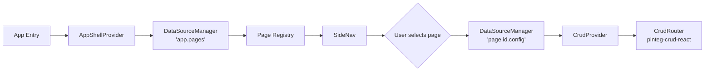
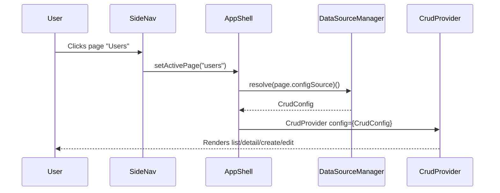

# PInteg App Shell

## Motivation

As the PInteg ecosystem grows, there is a need for a host application layer that can assemble multiple CRUD modules into a coherent corporate interface — without coupling the navigation structure to any specific implementation.

`pinteg-app-shell` is a thin, config-driven shell that:
- Reads a **page registry** from `DataSourceManager` (routes, groups, titles).
- Renders a persistent **side navigation bar** with grouped pages and a quick-search input.
- Dynamically loads each page as a `CrudProvider` (from `pinteg-crud-react`) using a per-page `DataSourceManager` config.

This allows any team to register new pages purely through configuration — no code changes to the shell itself.

---

## Architecture Overview



---

## Config API

The shell is initialized with a single `AppShellConfig`:

```typescript
export interface AppShellConfig {
    /** DSM key that returns the list of registered pages */
    pageRegistry: string;
    /** Optional app title shown in the nav header */
    title?: string;
    /** Optional logo URL */
    logoUrl?: string;
}
```

### Page Registry

The `pageRegistry` DSM key must resolve to an array of `PageDefinition`:

```typescript
export interface PageDefinition {
    /** Unique identifier, used to build the DSM key for page config */
    id: string;
    /** Display name shown in the nav bar */
    title: string;
    /** Optional group label for nav grouping */
    group?: string;
    /** DSM key that returns the CrudConfig for this page */
    configSource: string;
}
```

### Page Config Source

Each page's `configSource` key must resolve to a full `CrudConfig` (from `pinteg-crud-react`):

```typescript
export interface CrudConfig {
    title: string;
    description?: string;
    schema: {
        list:   string; // DSM key -> ComponentSchema
        detail: string; // DSM key -> ComponentSchema
    };
    dataSource: {
        list:   string;
        get:    string;
        create: string;
        update: string;
        delete: string;
    };
    primaryKeyField: string;
}
```

---

## Navigation Bar

### Behaviour
- Displays all pages grouped by their `group` field.
- Groups are sorted alphabetically; ungrouped pages appear under an implicit "General" group.
- A **search input** at the top of the nav filters pages by name (case-insensitive, partial match).
- The active page is highlighted.
- On mobile, the nav collapses into a hamburger menu.

### Layout (desktop)

```
+---------------------------------------------------------+
|  [Logo]  App Title                        [User/Theme]  |
+---------------+-----------------------------------------+
|  Search...    |                                         |
|               |         <Active Page Content>           |
|  - GROUP A -  |         (CrudProvider + CrudRouter)     |
|    Page 1     |                                         |
|    Page 2     |                                         |
|  - GROUP B -  |                                         |
|    Page 3     |                                         |
+---------------+-----------------------------------------+
```

---

## Page Loading Flow



---

## Demo App (`apps/demo-app-shell`)

A demonstration app will be created to showcase the shell with mock data.

### Registered DSM sources

```typescript
// Page registry
DataSourceManager.register('app.pages', async () => [
    {
        id: 'users',
        title: 'Users',
        group: 'Administration',
        configSource: 'page.users.config',
    },
    {
        id: 'products',
        title: 'Products',
        group: 'Catalog',
        configSource: 'page.products.config',
    },
]);

// Per-page CrudConfig
DataSourceManager.register('page.users.config', async () => ({
    title: 'User Management',
    schema: { list: 'users.schema.list', detail: 'users.schema.detail' },
    dataSource: {
        list:   'users.list',
        get:    'users.get',
        create: 'users.create',
        update: 'users.update',
        delete: 'users.delete',
    },
    primaryKeyField: 'id',
}));

// ... schemas and CRUD handlers registered separately
```

---

## Requirements

| # | Requirement |
|---|-------------|
| R1 | The shell reads the page list from a DSM key defined in `AppShellConfig.pageRegistry`. |
| R2 | Pages can be grouped; groups are rendered as labelled sections in the nav. |
| R3 | A search input filters pages by title in real time. |
| R4 | Clicking a page resolves its `configSource` from DSM and mounts a `CrudProvider`. |
| R5 | The shell must handle loading and error states when resolving pages or configs. |
| R6 | The nav must be responsive: side-bar on desktop, drawer/hamburger on mobile. |
| R7 | A demo app (`apps/demo-app-shell`) must register at least 2 groups with 2+ pages each. |
| R8 | Unit tests in `tst/` covering: page registry resolution, search filtering, and page config loading. |

---

## Effort Estimate

| Requirement | Points |
|-------------|--------|
| R1 – Page registry via DSM | 3 |
| R2 – Grouped nav with labels | 3 |
| R3 – Search filtering | 2 |
| R4 – Dynamic CrudProvider loading | 5 |
| R5 – Loading/error states | 2 |
| R6 – Responsive nav | 5 |
| R7 – Demo app | 3 |
| R8 – Unit tests | 5 |
| **Total** | **28** |
