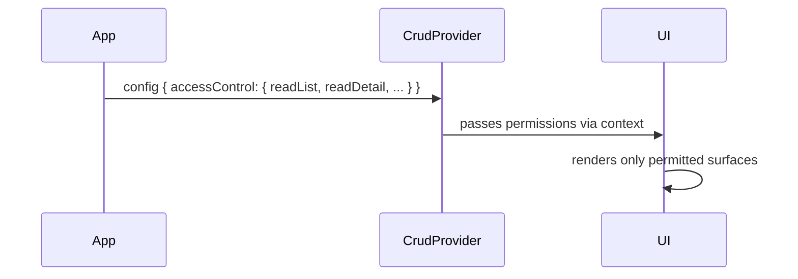

# PInteg CRUD React — Access Control

## Motivation

`pinteg-crud-react` renders list, detail, create, update, and delete operations
based on a `CrudConfig`. As the system grows toward a corporate shell (`pinteg-app-shell`)
where multiple teams and roles share the same pages, access must be controlled
per-operation without embedding authorization logic inside the CRUD package itself.

Access control is defined as a set of **plain boolean flags** passed directly
in the config. The consuming application is responsible for computing those booleans
(from a role system, auth token, feature flag, or any other mechanism) before
constructing the `CrudConfig`.

---

## Controlled Operations

Five mandatory boolean flags map directly to the CRUD surfaces:

| Flag | Controls |
|------|----------|
| `readList`   | Whether the listage table is rendered. |
| `readDetail` | Whether the accordion/detail panel can be expanded. |
| `create`     | Whether the "New" button and create flow are accessible. |
| `update`     | Whether the "Edit" / "Save Changes" buttons appear in the detail panel. |
| `delete`     | Whether the Danger Zone / Delete button is rendered. |

---

## Config API

`accessControl` is a **mandatory** field in `CrudConfig`:

```typescript
export interface CrudAccessControl {
    readList:   boolean;
    readDetail: boolean;
    create:     boolean;
    update:     boolean;
    delete:     boolean;
}

export interface CrudConfig {
    title: string;
    description?: string;
    schema: CrudSchemas;
    dataSource: CrudDataSource;
    primaryKeyField: string;
    accessControl: CrudAccessControl; // mandatory
}
```

### Usage example

```typescript
const config: CrudConfig = {
    title: 'User Management',
    schema: {
        list:   'userManager.schema.list',
        detail: 'userManager.schema.detail',
    },
    dataSource: {
        list:   'userManager.list',
        get:    'userManager.get',
        create: 'userManager.create',
        update: 'userManager.update',
        delete: 'userManager.delete',
    },
    primaryKeyField: 'id',
    accessControl: {
        readList:   true,
        readDetail: true,
        create:     true,
        update:     true,
        delete:     false, // delete locked for this role
    },
};
```

The consuming application computes these booleans from whatever auth/role
mechanism it uses before building the config object.

---

## UI Effect per Flag

> No operation is merely *disabled* — it is fully **hidden** to avoid
> leaking affordances to unauthorized users.

| Flag | `false` effect |
|------|----------------|
| `readList`   | Renders an "Access Denied" message instead of the table. |
| `readDetail` | Chevron/expand button is hidden; rows cannot be opened. |
| `create`     | "New" button is hidden; create route is blocked. |
| `update`     | "Edit" button is hidden; detail panel is always read-only. |
| `delete`     | Danger Zone section is not rendered. |

---

## Architecture Flow



No async resolution — access flags are synchronous booleans available
immediately at render time.

---

## Requirements

| # | Requirement |
|---|-------------|
| R1 | `CrudConfig.accessControl` is a **mandatory** field — omitting it is a TypeScript error. |
| R2 | `CrudAccessControl` has five boolean fields: `readList`, `readDetail`, `create`, `update`, `delete`. |
| R3 | When `readList` is `false`, render an access denied state instead of the table. |
| R4 | When `readDetail` is `false`, the row expand button is hidden. |
| R5 | When `create` is `false`, the "New" button and create flow are hidden. |
| R6 | When `update` is `false`, Edit/Save buttons are hidden; detail panel is read-only. |
| R7 | When `delete` is `false`, the Danger Zone section is not rendered. |
| R8 | Unit tests covering each flag individually and combined scenarios. |

---

## Effort Estimate

| Requirement | Points |
|-------------|--------|
| R1 – Config interface update | 1 |
| R2 – Boolean flag typing | 1 |
| R3 – readList denied state | 2 |
| R4 – readDetail hidden chevron | 1 |
| R5 – create hidden button/flow | 2 |
| R6 – update read-only mode | 3 |
| R7 – delete hidden danger zone | 1 |
| R8 – unit tests | 5 |
| **Total** | **16** |
