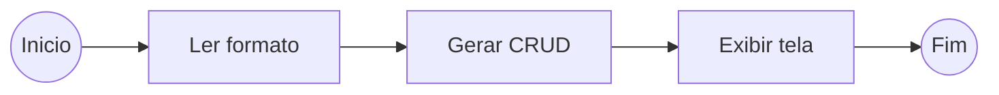
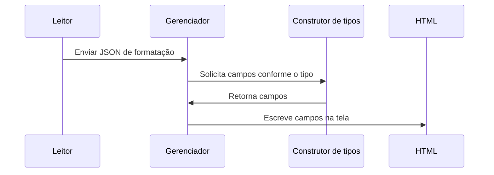

# Gerador de CRUD
> Biblioteca para a geração de telas de CRUD em runtime!

O objetivo principal é a geração de uma biblioteca responsável por gerar telas em HTML a partir da configuração de um objeto JSON. Essa tela será utilizada em cadastros em geral, com as possibilidades de: criação, visualização e atualização de objetos.

## Contextualização do projeto
A ideia é utilizar a biblioteca para facilitar a criação das telas de CRUD que são telas muito usadas na maioria dos sistemas, principalmente comerciais. O usuário irá precisar definir uma formatação dos campos utilizados através de um JSON e a bibliota irá interpretar essas definições e montar a tela para que o usuário possa visualizar, editar ou criar dados.



Um arquivo em JSON fará a definição dos campos que serão criados na tela. 

### Sequência de processo para criação da tela 


### Exemplo 
####  Arquivo de formatação:
```json
{
	nome: {
		type: "string",
		caption: "Nome completo”,
		size: "L"
		},
	idade: {
		type: "int",
		caption: "Nome completo",
		size: "L"
		},
}
```

#### Formato da tela gerada:
```
Nome complete
[                            ]

Idade
[                            ]
```


## Requisitos do sistema
Os requisitos do sistema são condições cujas exigências devem ser atendidas e estão melhor especificados nos subtítulos abaixo.

### Criar projeto typescript para execução do projeto
O projeto será executado em typescript, e será uma biblioteca que será utilizada por outros desenvolvedores. Para iniciar o projeto, é necessário a criação do projeto inicial em typescript, usando o node para transpiração e execução do código.

###  Configurar jest e criar teste unitário de exemplo
Deve ser incluso no projeto a biblioteca de teste jest e deve ser criado um teste unitário simples, apenas como exemplo para execução dos demais testes que devem ser criados juntamente com cada tarefa.
Referências para consulta:
- https://www.testim.io/blog/typescript-unit-testing-101/.

### Criar classe da interface de tipo de campos
Como vemos no exemplo do JSON de definição, temos o campo _type_, ele é responsável pela definição do campo que será carregada na tela. Esses tipos serão todos definidos por uma interface principal.
Essa interface deve obrigar o objeto a ter os seguintes itens: caption, size, build(element).
- caption: campo para a descrição do campo;
- size: este campo será uma outra classe, onde por padrão terá 3 valores fixos dentro do sistema, grande (“L”), médio (“M”) e pequeno (“S”);
- build(element): essa função será responsável por inserir o campo dentro do elemento recebido por parâmetro.

### Criar classe de construção e cadastro de tipos
Para esta tarefa será necessário criar uma classe do tipo _Factory_ (_design pattern_), na qual irá ter apenas a função _Create_, que deve receber o nome do tipo em texto e retornar um objeto da interface de campos. Esses tipos, devem ser armazenados em um map, onde serão indexados pelo nome, Inicialmente esse map vai ser inicializado vazio, mas vai ser alterado em outra tarefa com os tipos padrões da biblioteca.
Outra parte importante da tarefa, é criar a opção de registros de novos tipos, ou seja, se o usuário desejar, ele poderá cadastrar tipos personalizados de campos. Por isso, deve ser criado uma função para permitir o registro desses novos itens no map.
Referências para consulta:
- https://refactoring.guru/design-patterns/factory-comparison#:~:text=Simple%20factory%20pattern
- https://www.codecademy.com/resources/docs/javascript/hashtables

###  Criar tipos padrões
Nessa tarefa deve ser criado os tipos de campos padrões da biblioteca. Inicialmente vamos iniciar com poucos, mas de acordo com as necessidades, podem ser incrementados.
- string: esse será um campo simples onde aceita qualquer texto como input.
- integer: esse campo deverá restringir os inputs a números inteiros sejam eles negativos ou positivos.
- double: campo que aceita input de números com virgula (cuidado: dependendo da língua isso muda, como em inglês, que o ponto é o separador) ou inteiros
- list: esse campo é o mais diferente de todos, o objetivo é ter uma lista de opções para o usuário final, essa lista é preenchida por objetos, onde é exibido um dos atributos.

###  Criar classe de controle
Nesta tarefa será criada a classe principal do sistema. Ela é a classe responsável por gerenciar a leitura do JSON de definição e fazer a chamada da classe de criação de tipos (de acordo com o configurado no campo _type_).

###  Publicar versão
Criar publicação da primeira versão da biblioteca no *npm*. Lembrando que é importante ter uma descrição sobre a biblioteca junto com a publicação na plataforma.

Referências para consulta:
- https://docs.npmjs.com/creating-and-publishing-scoped-public-packages

### Documentar biblioteca
Como tela principal do github, é importante ter uma documentação breve de como utilizar a biblioteca. Deve ser feita a documentação dos primeiros passos de como utilizar o sistema, no formato de markdown.
Referências para consulta:
- https://docs.github.com/en/get-started/writing-on-github/getting-started-with-writing-and-formatting-on-github/basic-writing-and-formatting-syntax

## Esforço
Esforço necessário para execução de cada requisito do projeto

| Requisito                                         | Esforço em pontos |
|---------------------------------------------------|-------------------|
| Criar projeto typescript para execução do projeto | 1                 |
| Configurar jest e criar teste unitário de exemplo | 2                 |
| Criar classe da interface de tipo de campos       | 3                 |
| Criar classe de construção e cadastro de tipos    | 5                 |
| Criar tipos padrões                               | 8                 |
| Criar classe de controle                          | 3                 |
| Publicar versão                                   | 5                 |
| Documentar biblioteca                             | 3                 |
