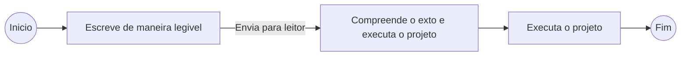
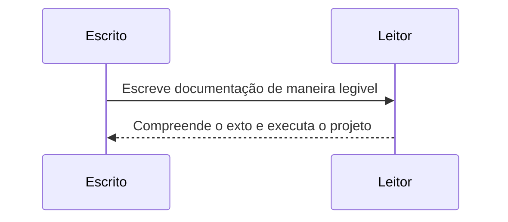

# Template de documentação de projeto

Este é um template de documentação de projeto escrito utilizando [Markdown](http://cursos.leg.ufpr.br/prr/capMarkdown.html). É recomendado utilizar o editor [StackEdit](https://stackedit.io/) para facilitar a execução da documentação.
Neste trecho, o escritor deverá descrever brevemento sobre o projeto. Além disso, esse documento será separado nos seguintes sub-titulos:
- Contextualização do projeto
- Requisitos do sistema
- Esforço

## Contextualização do projeto
Este sub-titulo é feito para dar contextualização ao projeto, nele o escritor deve dar um contexto geral do problema existente, contextualizando o porque do projeto a ser executado.
Também é recomendado ao escritor adicionar um fluxo grama do processo desejado, para que o leitor possa ter uma compreensão simple da solução.





## Requisitos do sistema
Os requisitos do sistema são condições cujas exigências devem ser atendidas e estão melhor especificados nos sub-titulos abaixo.

### Requisito 01
Cada requisito deve ser  decrever uma funcionalidade que o sistema deve ter.  Para a descrição o escritor pode se utilizar atificios de destaque do markdown como: **negrito**, *itálico*,  .
Também, faz parte da descrição os casos de uso da funcionalidade solicitada. 

> Caso de uso 01
> Nome: Exemplo de caso de uso
> Atores: Atores envolvidos
> Pré-requisitos: Pré-requisitos necessário para executar o caso e uso
> Fluxo:
> 1. Passo 01;
> 2. Paso 02;
> 3. (...)
> 4. Passo N.


```
Você pode usar código ou trechos em trecho em destaque, se necessário!
```


### Requisito 02
(...)

### Requisito N
(...)


## Esforço
Esforço necessário para execução de cada requisito do projeto

| Requisito       | Esforço em points |
|-----------------|-------------------|
| Requisito 01    | 5                 |
| Requisito 02    | 13                |
| (...)           | (...)             |
| Requisito 01    | 2                 |
